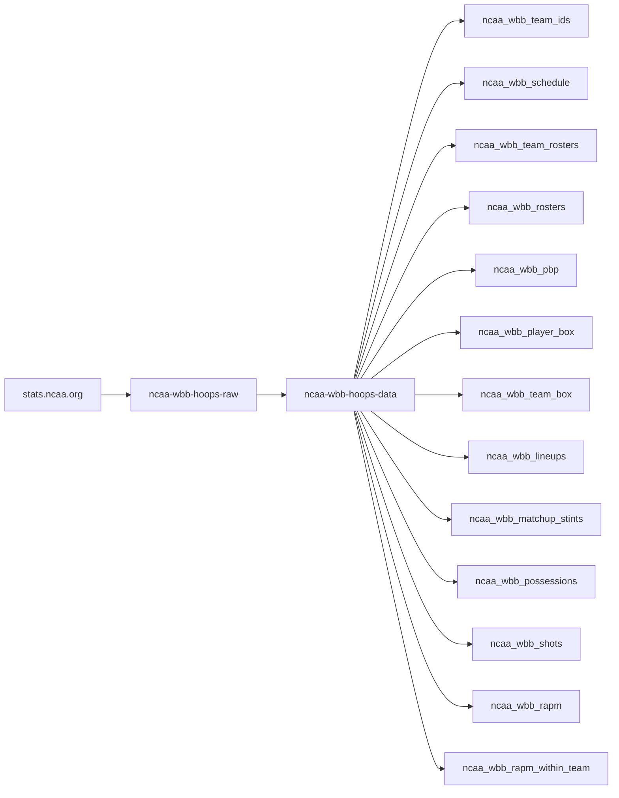
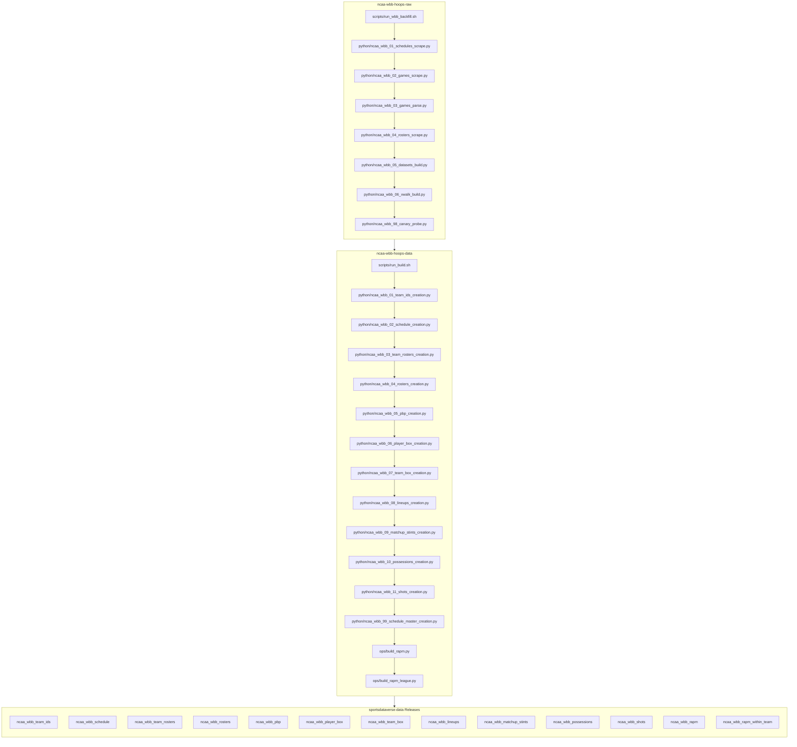

# ncaa-wbb-hoops-raw
NCAA WBB Raw Data

Raw-page capture + parse pipeline for `stats.ncaa.org` women's college
basketball. Three stages: **discover** (season -> contest_ids) -> **capture**
(contest -> 3-page HTML bundle) -> **parse** (bundle -> combined per-game
JSON). Data tree lives under `<root>/wbb/` (default root = repo root):
`schedule_master.parquet`, `raw/{season}/{contest_id}.json.gz`,
`json/{contest_id}.json`.

Three further committed datasets — **schedules**, **teams**, **rosters** — ride
along for free. `discover` already fetches every team's schedule page and
`rosters` already fetches every roster page, so both trees are persisted from
those existing fetches at **zero extra HTTP**; `teams` needs no fetch at all
(it is the bundled sdv-py crosswalk). Per team the source `html` and the parsed
`json` are kept; `parquet` is the one compiled dataset per season:

```
wbb/schedules/html/{season}/{team_id}.html     wbb/rosters/html/{season}/{team_id}.html
wbb/schedules/json/{season}/{team_id}.json     wbb/rosters/json/{season}/{team_id}.json
wbb/schedules/parquet/{season}.parquet         wbb/rosters/parquet/{season}.parquet
wbb/teams/{html,json,parquet}/{season}.*
```

Every one of them carries human-readable names next to the machine ids —
schedules pair `team_id`/`opponent_id` with `team`/`opponent`, rosters pair
`player_id` with `clean_name` (display form) *and* `player` (the ALL-CAPS
`FIRST.LAST` play-by-play join key), teams pair `ncaa_team_id` with the NCAA
name, conference and `division` (constant `"I"` — the crosswalk is scoped to
the Division-I `season_divisions` id).

**These three trees are also where the ESPN identity lives.** All three are
reference data, so each carries the ESPN team id from sdv-py's
`ncaa_espn_team_crosswalk`: schedules for both sides (`espn_team_id` /
`opponent_espn_team_id`), rosters for the roster's team, teams for the team
plus ESPN's display name and mascot. The **per-game** parsed families
(`pbp`, `possessions`, `player_box`, `team_box`, `shots`, `lineups`) carry
`*_ncaa_team_id`, the player ids and the readable names — but deliberately
**no** ESPN ids: repeating a reference id on millions of play rows is bloat,
so join `teams` on `ncaa_team_id` instead. Each parsed game does ship a
two-row `teams` block with the full ESPN identity for its own two sides.

On the play-by-play side the identity pass also resolves the ten on-court
slots — `home_1`..`home_5` / `away_1`..`away_5` on `pbp` and `possessions`
each gain `{slot}_player_id` + `{slot}_clean_name` — off the same
game-scoped roster index as `player_1`/`player_2`.

This is a retarget of the sibling `hoopR-dev/ncaa-mbb-hoops-raw` scraper --
same transport, same fetcher, same safe-rate rules. The `python/` package
(`ncaa_bundle.py` / `ncaa_wbb_02_games_scrape.py` / `ncaa_wbb_01_schedules_scrape.py` / `ncaa_wbb_03_games_parse.py`)
defaults `--league` to `"wbb"` throughout; `"mbb"` remains a legitimate
runtime value there for parity/regression checks against the MBB scraper.

## ncaa-wbb-hoops workflow diagram





`scripts/run_wbb_backfill.sh` (raw) and `scripts/run_build.sh` (data) are the
drivers; `run_autocommit.sh` commits captures as they land. Stage numbers are
intended build order, not run order. WBB is HALVES before season 2016; the
quarters model silently empties those seasons.

[wehoop-wbb-raw repository (source: ESPN)](https://github.com/sportsdataverse/wehoop-wbb-raw)

[wehoop-wbb-data repository (source: ESPN)](https://github.com/sportsdataverse/wehoop-wbb-data)

[wehoop-wnba-raw repository (source: ESPN)](https://github.com/sportsdataverse/wehoop-wnba-raw)

[wehoop-wnba-data repository (source: ESPN)](https://github.com/sportsdataverse/wehoop-wnba-data)

[wehoop-wnba-stats-raw repository (source: WNBA Stats)](https://github.com/sportsdataverse/wehoop-wnba-stats-raw)

[wehoop-wnba-stats-data repository (source: WNBA Stats)](https://github.com/sportsdataverse/wehoop-wnba-stats-data)

[ncaa-wbb-hoops-raw repository (source: stats.ncaa.org)](https://github.com/sportsdataverse/ncaa-wbb-hoops-raw)

[ncaa-wbb-hoops-data repository (source: stats.ncaa.org)](https://github.com/sportsdataverse/ncaa-wbb-hoops-data)

## Setup

Requires the sibling `sdv-py` checkout at
`C:/Users/saiem/Documents/GitHub-Data/sdv-dev/sdv-py` with its `.venv`
synced (`uv sync --all-extras --dev` there). Discover + capture also need
ProxyBonanza creds in `~/.Renviron` (or `~/Documents/.Renviron`):

```
PROXYBONANZA_API_KEY=...
PROXY_PKG=...
```

The launchers read these at call time and never print or persist the raw
values. `parse` is fully offline and needs no creds.

## Run order

```sh
bash scripts/run_01_schedules.sh --season 2025  # -> wbb/schedule_master.parquet
                                               #    + wbb/schedules/{html,json}/2025/
bash scripts/run_02_games.sh     --season 2025  # -> wbb/raw/2025/{contest_id}.json.gz
bash scripts/run_03_parse.sh                    # -> wbb/json/{contest_id}.json
bash scripts/run_04_rosters.sh   --season 2025  # -> wbb/rosters/{html,json}/2025/
bash scripts/run_05_datasets.sh  --season 2025  # -> the season parquets + wbb/teams/
```

`run_05_datasets.sh` is fully offline (no creds, no network) and **not sharded**:
each season parquet is a single output file, so concurrent `--shard` workers
would race it. Run it once, after the sharded sweeps finish. It also re-derives
any missing per-team json from committed html, so a parser fix can be replayed
across every captured season with `--overwrite` and no re-scrape.

Or the one-command chained backfill (discover -> capture -> parse, resumable):

```sh
./scripts/run_wbb_backfill.sh 2025
CHUNK=1500 ./scripts/run_wbb_backfill.sh 2025          # stop after 1500 new bundles (recommended)
WORKERS=2 CHUNK=1500 ./scripts/run_wbb_backfill.sh 2025 # 2 workers (measured ceiling)
```

`run_wbb_backfill.sh` is the **single-season** chain. The other wrapper
drivers around the per-stage sequence:

- `scripts/run_wbb_backfill_range.sh [start] [end]` — **multi-season
  campaign** (default 2025 down to 2010), newest-first, wrapping
  `run_wbb_backfill.sh` per season: capture runs in chunked rounds (a
  fresh sticky IP each chunk) with cooldowns between rounds and after
  ban hard-stops, and up to `MAX_ROUNDS` straggler rounds per season
  before moving on (re-run later to finish the remainder).
- `scripts/run_reference_backfill.sh [start] [end]` — reference-only
  companion to the pbp backfill: per season (newest-first) it chains
  `run_01_schedules.sh` -> sharded `ncaa_wbb_04_rosters_scrape.py` -> `run_05_datasets.sh`,
  then commits + pushes that season. Reference data is cheap (~2 pages
  per team-season vs 3 per game), so it runs first / independently of
  `run_wbb_backfill*.sh`; it does **no** pbp capture.
- `scripts/droplet_wbb_capture.sh` — the **droplet (Linux) capture
  launcher**. The base runners default to the Windows dev-box venv; this
  exports the droplet's `SDV_PY` and the `decodo_patchright` vendor
  transport (the US-residential sticky port pool in `canary_vendors.toml`,
  gitignored) and delegates. Every other knob stays env-only, exactly as the
  base runners document them. It refuses to start without
  `canary_vendors.toml` or the droplet venv.

  ```sh
  ./scripts/droplet_wbb_capture.sh --season 2025 --max-contests 25
  WORKERS=4 ./scripts/droplet_wbb_capture.sh --season 2025
  tmux new -s wbb './scripts/droplet_wbb_capture.sh --season 2025'   # survive SSH loss
  tail -f logs/capture_<ts>.log
  ```

- `scripts/droplet_wbb_campaign.sh` — the **OOM-shielded multi-worker
  campaign** around `run_wbb_backfill.sh`, with auto-halving workers. The
  droplet also runs postgres (sdv-db), sdv-db-api, the sdv-orch services and
  a GH Actions runner; eight chrome workers can exceed available RAM, and
  the kernel's OOM killer picks the largest RSS — which is postgres, not the
  capture. `choom -n 1000` scores the capture tree maximally killable, and
  `oom_score_adj` is inherited by every python and chrome descendant, so the
  sweep is sacrificed before any production service. Capture checkpoints
  per file, so an OOM kill costs at most one bundle per worker.

  ```sh
  ./scripts/droplet_wbb_campaign.sh 2025             # WORKERS=8 (default)
  WORKERS=4 ./scripts/droplet_wbb_campaign.sh 2025
  tail -f logs/campaign_<season>_<ts>.log
  ```

  Use `run_wbb_backfill_range.sh` for the multi-season sequence; the
  campaign script deliberately does not duplicate its per-season round and
  cooldown logic.

- `scripts/run_autocommit.sh` — incremental commit(+push) sweep of
  capture output every `INTERVAL` seconds. It stages only files whose
  mtime has settled at least `SETTLE` minutes, so an in-flight bundle
  is never committed half-flushed — safe to run **concurrently with an
  active capture**. The backfill drivers deliberately do not commit;
  this keeps the repo close to pushed during a long campaign.
- `ops/watchdog_stalled_capture.sh` — **required alongside a
  multi-season campaign.** A sticky session stops clearing bm-verify
  after ~70 min, so the last workers of each season outlive their
  session and spin without writing anything. Their `run_02_games.sh`
  wrapper has already printed `EXIT=`, so the python child is orphaned
  while the season driver is still blocked in `wait()` — the campaign
  stalls until someone kills them by hand. The watchdog kills
  non-producing capture workers by PID so `wait()` returns and the
  campaign advances; nothing is lost, since disk is the checkpoint and
  a later re-run picks up the stragglers. Launch it next to the range
  driver:

  ```sh
  mkdir -p logs && nohup bash ops/watchdog_stalled_capture.sh >> logs/watchdog.log 2>&1 &
  ```

  Knobs: `STALL_S` (default 480 — a cold bm-verify solve is 45-80s and
  retries for a few minutes, so 8 min clears real work but not a hang),
  `INTERVAL` (default 120). Over the 2026→2010 campaign it fired 10
  times, all correct, zero spurious.

Watch a running job live:

```sh
tail -f logs/capture_*.log
tail -f logs/backfill_<season>_<ts>.log   # path is printed at start of run_wbb_backfill.sh
```

**The backfill is a USER-run, residential-IP job.** `stats.ncaa.org` bans
datacenter/cloud IPs, so it must be launched from a real terminal on a
residential connection -- not scheduled or run from a cloud agent.

## Season ceiling: tracks the bundled crosswalk (currently 2026, i.e. 2025-26)

The bundled WBB team-id crosswalk
(`sportsdataverse/wbb/data/ncaa_teamids_wbb.csv`) covers **2009-10 through
2025-26** (the 2025-26 rows landed in sdv-py; 2026 discovery has already run
clean here -- 6,019 contests in `schedule_master`, 359 schedule pages
committed).

For a season past the crosswalk, `discover_season(..., league="wbb")` raises
`ValueError("No teams found in crosswalk for season=... ")`, worded as if
the NCAA team-ids URL format had drifted -- the real cause is crosswalk
coverage, not format drift. `scripts/run_wbb_backfill.sh` guards this up
front (`MAX_SEASON`, currently 2026) and refuses out-of-range seasons with a
message naming the actual cause, before any network call is made. **Bump
`MAX_SEASON` when the crosswalk grows** -- a stale guard reads as a capture
hard-stop to the range driver (this burned the 2026-08-01 campaign's first
round). `run_01_schedules.sh` / `run_02_games.sh` / `run_03_parse.sh` don't carry
their own guard (they're thin pass-throughs to the python CLIs), so calling
them directly with an out-of-range season still surfaces the raw
crosswalk-coverage `ValueError` from `discover_season`.

## Safe-rate rule (capture)

**The worker ceiling is pool-relative, not absolute** (user-verified
2026-08-01 on the MBB sibling, `docs/SCRAPING_NOTES.md`): the old "1-2
workers max" rule was measured on a shared datacenter pool. With per-worker
DISJOINT sticky residential ports (the `decodo_patchright` port pool), up to
8 workers have run clean — what matters is **per-IP pacing**, and the
fetcher shards the port pool by worker index so workers never pile onto one
port. Each worker is a *separate process* running `run_02_games.sh` with a
disjoint `--shard i/N` -- never threads inside one process. On a
shared/unsharded pool, stay at 1-2:

```sh
./scripts/run_02_games.sh --season 2025                    # 1 worker (proven-safe default)
./scripts/run_02_games.sh --season 2025 --shard 0/2 &       # 2 workers, only after 1-worker is stable
./scripts/run_02_games.sh --season 2025 --shard 1/2 &
```

`run_wbb_backfill.sh` caps `WORKERS` at 1..16 (keep at least 2 ports per
worker); anything else is refused before any network call.

A ban-suspect response is a **hard stop**, not a retry: the process exits
immediately (`BAN-SUSPECT: capture halted at contest_id=...`). Wait out the
cooldown before resuming -- do not immediately re-launch.

⚠️ On a persistent ban, the upstream `NcaaFetcher` retries across the entire
residential proxy pool with no delay before raising -- so a single
ban-detection can send a ~pool-sized burst before the scraper hard-stops.
This is bounded (the run terminates), but re-running immediately into a live
ban will re-churn the pool. On a `BAN-SUSPECT` stop, WAIT for a multi-minute
cooldown before resuming.

## The 4-quarter period model (WBB vs MBB delta)

WBB play-by-play ships **one table per quarter** (4 regulation periods, 10
minutes each, 5-minute overtimes -- `_WBB_PERIOD_MODEL = (4, 600, 300)` in
`python/ncaa_wbb_03_games_parse.py`), where MBB ships **one table per half** (2 periods).
`parse_bundle(..., league="wbb")` (the default) selects this period model
automatically; nothing else in the capture/discover pipeline changes.

## Resume story

Every stage is idempotent and re-runnable:

- **discover** merges new contest_ids into the existing `schedule_master.parquet`
  (and checkpoints each swept team page under `wbb/.discover/{season}/`, so an
  aborted sweep resumes instead of restarting).
- **capture** resume is **file-exists based**: a contest is skipped iff its
  `wbb/raw/{season}/{contest_id}.json.gz` bundle is already on disk. The
  master's `captured` column is vestigial (always `False`) — see
  `docs/SCRAPING_NOTES.md` §5. Re-running after a ban-suspect stop (or a plain
  interruption) picks up where it left off.
- **parse** skips any contest_id that already has a `wbb/json/{contest_id}.json`
  output; re-running only parses newly captured bundles.

So `bash scripts/run_01_schedules.sh --season 2025 && bash scripts/run_02_games.sh --season 2025 && bash scripts/run_03_parse.sh`
(or the equivalent `./scripts/run_wbb_backfill.sh 2025`) is safe to re-run
wholesale after any interruption.

## Status

The `python/` package (league-binding shims over the shared
`sportsdataverse.scrape.ncaa` engine, sdv-py #328/#330) is complete and
validated offline. **The reference backfill HAS run live**: schedules,
rosters and teams for 2011-2026 are committed under `wbb/` (2026: 359
schedule + 359 roster pages, 2026-08-01). **The pbp capture has NOT yet
produced bundles** -- the 2026-08-01 campaign's first round died on the
stale season guard (fixed; see the season-ceiling section) and no
`wbb/raw/` tree exists yet. Run it per "Run order" above.

## Phase 2: the season `-data` builder

The season `-data` builder lives in the sibling repo
`../ncaa-wbb-hoops-data` (package `ncaa_wbb_data_build`), mirroring
`../ncaa-mbb-hoops-data`. It ingests this repo's committed `wbb/` tree over
HTTP from `main`, which is why the data tree must stay committed (see
`.gitignore`).

## Repository layout

<!-- BEGIN GENERATED: layout -->

```
ncaa-wbb-hoops-raw/
├── canary_out/
├── docs/   # explainers, model reports and dataset docs
├── logs/   # per-run logs (gitignored where large)
├── ops/   # cron definitions and runbooks
│   └── watchdog_stalled_capture.sh
├── python/   # Python pipeline stages, numbered in build order
│   ├── ncaa_wbb_raw_scrape/
│   ├── ncaa_wbb_01_schedules_scrape.py
│   ├── ncaa_wbb_02_games_scrape.py
│   ├── ncaa_wbb_03_games_parse.py
│   ├── ncaa_wbb_04_rosters_scrape.py
│   ├── ncaa_wbb_05_datasets_build.py
│   ├── ncaa_wbb_06_xwalk_build.py
│   └── ncaa_wbb_98_canary_probe.py
├── scripts/   # bash drivers (the daily/weekly entry points)
│   ├── droplet_wbb_campaign.sh
│   ├── droplet_wbb_capture.sh
│   ├── run_01_schedules.sh
│   ├── run_02_games.sh
│   ├── run_03_parse.sh
│   ├── run_04_rosters.sh
│   ├── run_05_datasets.sh
│   ├── run_98_canary.sh
│   ├── run_autocommit.sh
│   ├── run_reference_backfill.sh
│   ├── run_wbb_backfill.sh
│   └── run_wbb_backfill_range.sh
├── tests/   # test suite
│   ├── fixtures/
│   ├── test_01_schedules.py
│   ├── test_02_games.py
│   ├── test_03_parse.py
│   ├── test_05_datasets.py
│   ├── test_06_xwalk.py
│   ├── test_98_canary.py
│   ├── test_bundle.py
│   ├── test_identity.py
│   └── test_stage_numbering.py
└── wbb/
    ├── json/
    ├── raw/
    ├── rosters/
    ├── schedules/
    ├── team_rosters/
    ├── teams/
    └── xwalk/
```

<!-- END GENERATED: layout -->

## Reports & explainers

<!-- BEGIN GENERATED: reports -->

| Report | What it is | Last updated |
|---|---|---|
| [Resume the NCAA WBB backfill](docs/RESUME.md) | explainer | 2026-08-12 |
| [stats.ncaa.org scraping — everything we know (NCAA WBB raw)](docs/SCRAPING_NOTES.md) | explainer | 2026-08-12 |

<!-- END GENERATED: reports -->

## Automation & status

<!-- BEGIN GENERATED: status -->

| workflow | schedule | last run |
|---|---|---|
| [](https://github.com/sportsdataverse/ncaa-wbb-hoops-raw/actions/workflows/orphan_scripts.yml) | on push / PR / dispatch | 2026-08-27 |
| [](https://github.com/sportsdataverse/ncaa-wbb-hoops-raw/actions/workflows/tests.yml) | on push / PR / dispatch | 2026-08-27 |

<!-- END GENERATED: status -->

## Consumers

The packages that read what this repo produces:

- **R:** [wehoop](https://wehoop.sportsdataverse.org) — docs at <https://wehoop.sportsdataverse.org>
- **Python:** [`sportsdataverse (wbb_ncaa engine)`](https://github.com/sportsdataverse/sportsdataverse-py) — docs at <https://py.sportsdataverse.org>

## Stage inventory

Every numbered pipeline stage in `python/` (auto-listed; run subsets with the `scripts/*.sh` drivers by number or name):

- `python/ncaa_wbb_01_schedules_scrape.py`
- `python/ncaa_wbb_02_games_scrape.py`
- `python/ncaa_wbb_03_games_parse.py`
- `python/ncaa_wbb_04_rosters_scrape.py`
- `python/ncaa_wbb_05_datasets_build.py`
- `python/ncaa_wbb_06_xwalk_build.py`
- `python/ncaa_wbb_98_canary_probe.py`
